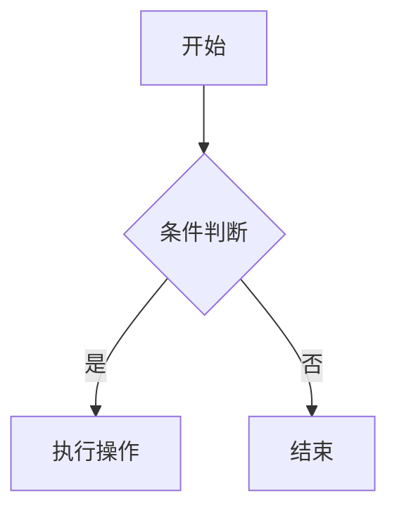

# mark-doc

**Markdown + DOCX 双编辑器** - 基于 Tauri v2 + React 19 的桌面应用


---

## 📖 项目简介

mark-doc 是一款专业的桌面编辑器，支持 Markdown 和 Word 文档的双向编辑与转换。基于 Linch Desktop Core 基座构建，提供现代化的编辑体验和完整的桌面应用能力。

### ✨ 核心特性

- 📝 **富文本编辑** - TipTap 3.20 驱动的 18 种格式化工具
- 🔄 **双向转换** - Word ↔ Markdown 无缝转换（基于 Pandoc）
- 📊 **图表支持** - Mermaid.js 流程图/序列图/甘特图
- 🎨 **主题切换** - 亮色/暗色/跟随系统
- 🌍 **多语言** - 中文/英文界面
- 💾 **自动保存** - localStorage 持久化
- 🚀 **跨平台** - Windows/macOS/Linux 支持

---

## 🚀 快速开始

### 环境要求

- Node.js >= 18
- pnpm >= 8
- Rust >= 1.77 (仅桌面版本)

### 安装依赖

```bash
pnpm install
```

### 开发模式

#### Web 版本
```bash
pnpm dev
# 访问 http://localhost:5173
```

#### 桌面版本
```bash
pnpm tauri dev
```

### 构建发布

```bash
# 前端构建
pnpm build

# Tauri 桌面应用构建
pnpm tauri build
```

**构建产物位置：**
- Web: `dist/`
- macOS App: `src-tauri/target/release/bundle/macos/`
- DMG: `src-tauri/target/release/bundle/dmg/`

---

## 📋 功能清单

### 编辑器功能
- ✅ 文字格式：粗体/斜体/下划线/删除线
- ✅ 样式：代码块/高亮/引用块
- ✅ 列表：无序列表/有序列表/任务列表
- ✅ 插入：表格/图片/链接
- ✅ 历史：撤销/重做
- ✅ 操作：保存/自动保存

### Markdown 支持
- ✅ GFM (GitHub Flavored Markdown)
- ✅ 表格语法
- ✅ 任务列表
- ✅ 删除线
- ✅ HTML ↔ Markdown 转换

### Mermaid 图表
- ✅ 流程图 (Flowchart)
- ✅ 序列图 (Sequence Diagram)
- ✅ 甘特图 (Gantt Chart)
- ✅ 类图 (Class Diagram)
- ✅ 饼图 (Pie Chart)

### Word 转换
- ✅ DOCX → Markdown
- ✅ Markdown → DOCX
- ✅ 图片自动提取
- ✅ 样式保留

### 系统功能
- ✅ 主题切换（亮色/暗色/跟随系统）
- ✅ 语言切换（中文/英文）
- ✅ 设置页面
- ✅ 日志系统
- ✅ 自动更新

---

## 🧪 测试

### 运行单元测试

```bash
pnpm vitest run
```

**当前测试覆盖：**
- ✅ Markdown 工具函数 (12 个测试)
  - markdownToHtml (8 个测试)
  - htmlToMarkdown (4 个测试)

### 测试覆盖率

```bash
pnpm vitest run --coverage
```

### 冒烟测试清单

- [ ] 应用启动测试
- [ ] 基本编辑功能测试
- [ ] 文件保存测试
- [ ] 主题切换测试
- [ ] 语言切换测试
- [ ] Markdown 导入导出测试
- [ ] Word 转换测试

---

## 📁 项目结构

```
mark-doc/
├── src/                          # 前端源代码
│   ├── components/               # React 组件
│   │   ├── Editor/              # 富文本编辑器
│   │   ├── Markdown/            # Markdown 预览
│   │   └── Mermaid/             # Mermaid 图表
│   ├── pages/                    # 页面组件
│   ├── services/                 # 服务层
│   ├── utils/                    # 工具函数
│   └── test/                     # 测试配置
├── src-tauri/                    # Tauri 后端
│   ├── src/                     # Rust 源代码
│   ├── Cargo.toml              # Rust 依赖
│   └── tauri.conf.json         # Tauri 配置
├── dist/                         # 构建产物
├── package.json                  # 前端依赖
├── tsconfig.json                 # TypeScript 配置
├── vite.config.ts                # Vite 配置
└── vitest.config.ts              # Vitest 配置
```

---

## 🛠️ 技术栈

### 前端
- **框架**: React 19 + TypeScript
- **构建**: Vite 7
- **编辑器**: TipTap 3.20
- **UI 组件**: shadcn/ui
- **样式**: Tailwind CSS 4
- **Markdown**: markdown-it + markdown-it-github
- **图表**: Mermaid.js v11
- **测试**: Vitest 4 + Testing Library

### 后端
- **框架**: Tauri v2
- **语言**: Rust
- **转换**: Pandoc

### 基座
- **Linch Desktop Core**: v0.2.0
  - 主题切换
  - 语言切换
  - 设置页面
  - 日志系统
  - UI 组件库
  - Hooks

---

## 📝 使用指南

### 编辑文档

1. 点击工具栏按钮应用格式
2. 使用快捷键提高效率：
   - `Ctrl+B` - 粗体
   - `Ctrl+I` - 斜体
   - `Ctrl+U` - 下划线
   - `Ctrl+Z` - 撤销
   - `Ctrl+Y` - 重做
   - `Ctrl+S` - 保存

### 插入表格

1. 点击工具栏的表格按钮
2. 默认插入 3x3 表格
3. 拖动表格边框调整大小

### 插入图片

1. 点击工具栏的图片按钮
2. 输入图片 URL
3. 或者拖拽图片到编辑器

### 插入链接

1. 选中文本
2. 点击工具栏的链接按钮
3. 输入链接 URL

### 使用 Mermaid 图表

````markdown

````

### Word 转换

1. 打开 Word 文档 (.docx)
2. 点击"Word → Markdown"按钮
3. 转换完成后编辑
4. 点击"Markdown → Word"导出

---

## 🔧 配置

### 环境变量

创建 `.env` 文件：

```bash
# 日志级别
VITE_LOG_LEVEL=info

# 自动保存间隔（秒）
VITE_AUTO_SAVE_INTERVAL=30
```

### Tauri 配置

编辑 `src-tauri/tauri.conf.json`：

```json
{
  "productName": "mark-doc",
  "version": "0.1.0",
  "identifier": "com.markdoc.app"
}
```

---

## 🤝 贡献

### 开发流程

1. Fork 项目
2. 创建特性分支 (`git checkout -b feature/AmazingFeature`)
3. 提交更改 (`git commit -m 'Add some AmazingFeature'`)
4. 推送到分支 (`git push origin feature/AmazingFeature`)
5. 开启 Pull Request

### 代码规范

- 使用 TypeScript 严格模式
- 遵循 ESLint 规则
- 编写单元测试
- 提交信息使用约定式提交

---

## 📄 许可证

MIT License - 详见 [LICENSE](LICENSE) 文件

---

## 📞 联系方式

- **项目主页**: [GitHub](https://github.com/laofahai/linch-pc-base)
- **问题反馈**: [Issues](https://github.com/laofahai/linch-pc-base/issues)

---

## 🙏 致谢

- [Tauri](https://tauri.app/) - 桌面应用框架
- [TipTap](https://tiptap.dev/) - 富文本编辑器
- [Mermaid](https://mermaid.js.org/) - 图表库
- [Linch Desktop Core](https://github.com/laofahai/linch-pc-base) - 桌面应用基座
- [shadcn/ui](https://ui.shadcn.com/) - UI 组件库

---

**Built with ❤️ using Tauri + React**
