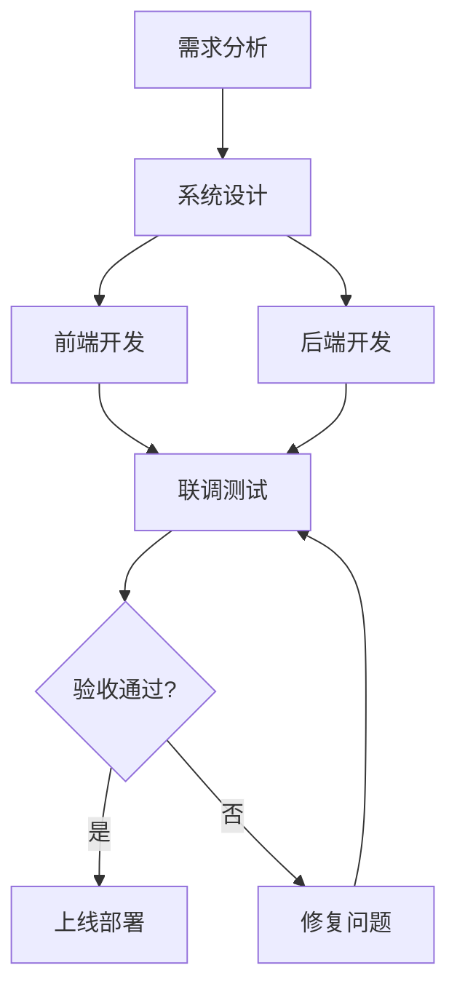
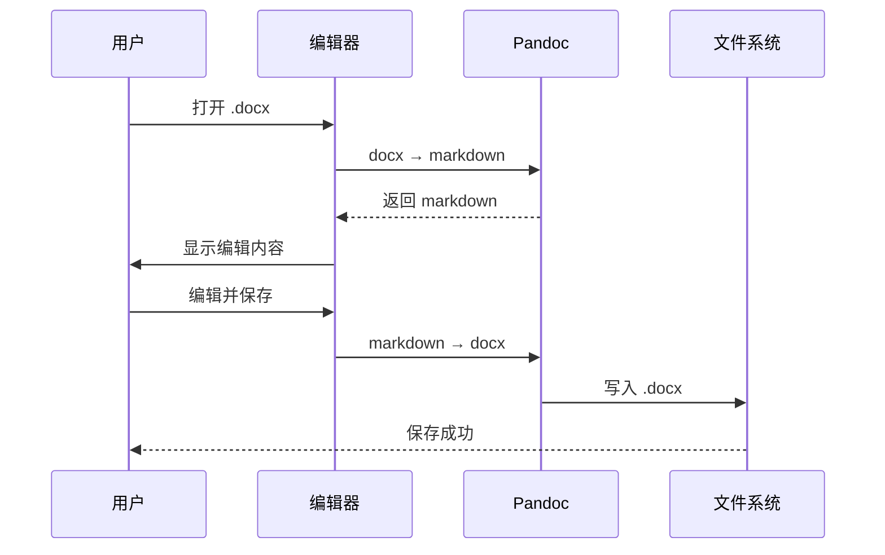

# 一、总体要求

为进一步规范公司文档管理流程，提升办公效率，根据《信息化建设三年规划》和相关制度要求，制定本实施方案。

文档管理系统应实现**统一存储、分级管理、高效协作**的目标，确保文档安全可控、流转有序。

## （一）指导思想

以数字化转型为契机，推动公司文档管理从传统纸质向*电子化、标准化、智能化*转变。

## （二）基本原则

1. **安全第一**：确保文档数据安全，建立完善的权限管理体系
2. **统一标准**：统一文档格式、编号规则和存储规范
3. **便捷高效**：简化操作流程，提升用户体验

# 二、主要任务

## （一）文档格式标准化

### 1. 公文格式要求

正文使用**宋体小四号**，标题使用**黑体**，行距固定值28磅。具体格式如下表：

| 元素 | 字体 | 字号 | 对齐 | 备注 |
|------|------|------|------|------|
| 标题 | 黑体 | 二号 | 居中 | 加粗 |
| 一级标题 | 黑体 | 三号 | 左对齐 | 加粗 |
| 二级标题 | 黑体 | 小三 | 左对齐 | 加粗 |
| 三级标题 | 黑体 | 四号 | 左对齐 | 加粗 |
| 正文 | 宋体 | 小四 | 两端对齐 | 首行缩进2字符 |

### 2. 数学公式支持

系统需支持 LaTeX 公式渲染。行内公式如 $E = mc^2$，以及独立公式块：

$$
\int_{0}^{\infty} e^{-x^2} dx = \frac{\sqrt{\pi}}{2}
$$

二次方程求根公式：

$$
x = \frac{-b \pm \sqrt{b^2 - 4ac}}{2a}
$$

### 3. 代码块支持

系统配置示例：

```yaml
document:
  format: docx
  template: reference.docx
  fonts:
    heading: SimHei
    body: SimSun
  margin:
    top: 2.54cm
    bottom: 2.54cm
```

## （二）技术架构

系统采用 Tauri + React 技术栈，核心组件如下：

- **前端**：React 19 + Vditor 编辑器
- **后端**：Rust (Tauri v2)
- **转换引擎**：Pandoc（内置 sidecar）
- **存储**：本地文件系统 + SQLite

### 1. 有序列表测试

1. 第一步：需求分析
   1. 用户调研
   2. 竞品分析
   3. 需求文档编写
2. 第二步：系统设计
   1. 架构设计
   2. 数据库设计
   3. 接口设计
3. 第三步：开发实现
4. 第四步：测试验收

### 2. 无序列表测试

- 核心功能
  - Markdown 编辑
  - Word 导出/导入
  - 实时预览
- 扩展功能
  - Mermaid 图表
  - LaTeX 公式
  - 版本控制

## （三）流程图与架构图

系统开发流程：



文档转换流程：



## （四）引用与脚注

> 文档管理是企业信息化建设的基础性工作，直接关系到企业的运营效率和知识传承。
>
> —— 《企业信息化管理指南》

正文内容中可以使用脚注进行补充说明[^1]。

[^1]: 本方案参考了国家标准 GB/T 9704-2012《党政机关公文格式》。

## （四）链接与强调

详细的技术规范请参考[Pandoc 官方文档](https://pandoc.org/MANUAL.html)。

需要特别注意的是：~~旧版格式不再支持~~，所有文档必须使用新版模板。

# 三、保障措施

## （一）组织保障

成立文档管理系统建设领导小组，由分管副总任组长，信息化部门牵头实施。

## （二）经费保障

项目总投资预算约 **50万元**，分两期实施：

| 阶段 | 时间 | 投资（万元） | 内容 |
|------|------|-------------|------|
| 一期 | 2026年Q2 | 30 | 基础平台搭建 |
| 二期 | 2026年Q4 | 20 | 功能完善与推广 |
| 合计 | — | 50 | — |

## （三）培训保障

分三批次完成全员培训，确保每位员工掌握系统操作。

---

*本方案自发布之日起施行，由技术部负责解释。*
